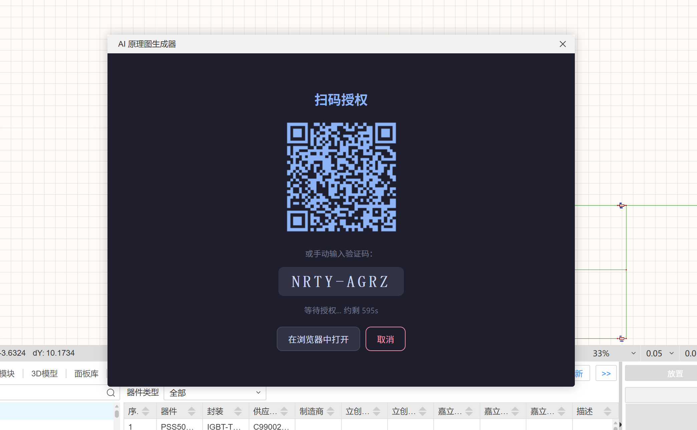
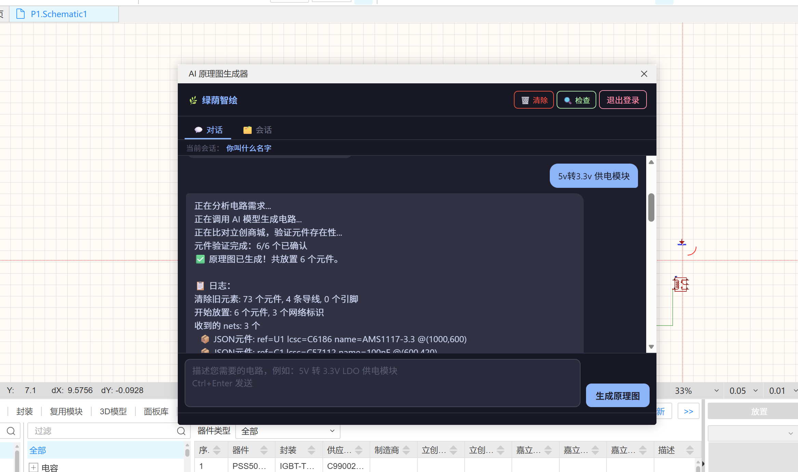

# 🌿 绿荫智绘

> **AI 驱动的立创 EDA 原理图生成器** — 用自然语言描述电路需求，AI 直接在 EDA 工具中帮你完成原理图设计

[](https://dotnet.microsoft.com/)
[](https://www.typescriptlang.org/)
[](https://www.postgresql.org/)
[](https://www.docker.com/)
[](https://github.com/bmadcode/bmad-method)

---

## 这是什么

想做硬件，却在原理图这一关被挡住了？

**绿荫智绘**（lceda-ai）是一个安装在**立创 EDA 专业版**里的 AI 插件，你只需用中文描述你想要的电路（比如"5V 转 3.3V 供电模块"），AI 就会自动搜索官方元件库、决定方案、连线，直接在 EDA 画布上生成可编辑的原理图。

这个项目同时也是一次完整的 **AI 辅助软件开发实践** — 从产品规划、架构设计到每一个 Story 的实现，全程使用 [BMAD 方法](https://github.com/bmadcode/bmad-method)驱动 AI 编程完成。

---

## 截图预览

<table>
  <tr>
    <td align="center"><b>扫码登录</b></td>
    <td align="center"><b>AI 对话 & 会话管理</b></td>
  </tr>
  <tr>
    <td></td>
    <td></td>
  </tr>
</table>

> 📸 截图待补充 — 将图片放到 `docs/screenshots/` 目录后上图自动显示

---

## 功能演示路径

```
用户在插件 IFrame 输入: "帮我画一个 5V 转 3.3V 的 LDO 供电模块"
        ↓
后端 CircuitParserAgent 解析意图，确定方案: AMS1117-3.3 + 输入电容 + 输出电容
        ↓
ComponentSearchTool 查询立创商城 API，获取官方库元件 UUID
        ↓
EDA SDK API 调用: 放置器件 → 连线 → 放置 GND/VCC 网络符号 → 保存文档
        ↓
可编辑的原理图出现在立创 EDA 画布上 ✅
```

---

## 技术栈

| 层 | 技术 |
|---|---|
| EDA 插件 | TypeScript + ESBuild + 立创 EDA Pro SDK (`.eext`) |
| 后端 API | ASP.NET Core 10 + Microsoft Agent Framework |
| AI 编排 | Semantic Kernel / OpenAI Function Calling |
| 数据库 | PostgreSQL 18 + EF Core (snake_case, Code-First) |
| 认证 | Keycloak — RFC 8628 设备码授权（IFrame 场景专用） |
| 通信 | REST + SSE（流式 LLM 输出） |
| 容器化 | Docker multi-stage (aspnet:10.0-alpine, 137MB) |

---

## 快速开始

### 前置条件

- Docker Desktop
- Node.js ≥ 20.5.0
- .NET 10 SDK（本地开发）
- 立创 EDA 专业版（安装插件用）

### 一键启动开发环境

```powershell
# 1. 克隆仓库
git clone https://github.com/your-org/lceda-ai.git
cd lceda-ai

# 2. 配置环境变量
cp .env.example .env
# 编辑 .env，填入 OPENAI_API_KEY

# 3. 启动所有服务（API + PostgreSQL + Keycloak）
.\scripts\start-local.ps1

# 4. 检查服务健康状态
.\scripts\health-check.ps1
```

启动后服务地址：
- **API** : http://localhost:5000
- **Keycloak** : http://localhost:8080 （admin / admin）
- **PostgreSQL** : localhost:5432 （dev / dev）

### 构建 EDA 插件

```bash
cd plugin
npm install
npm run build
# 输出: build/绿荫智绘.eext
```

在立创 EDA 专业版中：**扩展 → 扩展管理 → 安装本地扩展** → 选择 `.eext` 文件。

### 管理脚本

```powershell
.\scripts\start-local.ps1        # 启动所有服务
.\scripts\start-local.ps1 -Build # 重新构建 API 镜像后启动
.\scripts\stop-local.ps1         # 停止服务（数据保留）
.\scripts\stop-local.ps1 -RemoveVolumes  # 停止并清空数据库
.\scripts\view-logs.ps1 -Service api -Follow  # 跟踪 API 日志
.\scripts\health-check.ps1       # 检查所有服务健康状态
.\scripts\build-image.ps1        # 单独构建 API Docker 镜像
```

---

## 项目结构

```
lceda-ai/
├── plugin/                  # 立创 EDA 插件（TypeScript）
│   ├── src/index.ts         # 插件主线程入口
│   ├── iframe/              # IFrame UI（登录、对话、会话管理）
│   └── build.js             # ESBuild 打包脚本
├── backend/                 # ASP.NET Core 后端
│   └── AiSchGeneratorApi/
│       ├── Agents/          # CircuitParserAgent 等 AI 编排逻辑
│       ├── Tools/           # ComponentSearchTool 等 Function Tools
│       ├── Services/        # 业务服务层
│       ├── Controllers/     # REST API 端点
│       ├── Infrastructure/  # EF Core DbContext、仓储
│       └── Models/          # 数据模型
├── docker/
│   └── init-db.sql          # PostgreSQL 首次初始化脚本
├── scripts/                 # PowerShell 管理脚本
├── _bmad-output/            # BMAD 方法产出物（见下方详细说明）
│   ├── planning-artifacts/  # 产品规划文档
│   └── implementation-artifacts/  # Story 实现规格
└── docker-compose.yml
```

---

## 这个项目是怎么做出来的 — BMAD 方法与 AI 编程

这是这个项目最值得分享的部分。

**整个项目没有先写一行代码** — 而是先用 BMAD 方法的 AI Agent 把"应该做什么、怎么做"想清楚，再让 AI 去实现。

### BMAD 是什么

[BMAD（Breakthrough Method for Agile AI-Driven Development）](https://github.com/bmadcode/bmad-method) 是一套让 AI 在软件开发全生命周期充当专业角色的工作方法。它把 AI 变成产品经理、架构师、开发者、QA、技术写作等角色，通过结构化的工作流，产出人类和 AI 都能理解的规范文档，再用这些文档驱动具体编码。

### 规划文档如何指导 AI 编程

`_bmad-output/planning-artifacts/` 目录中的三个文档构成了完整的"AI 编程上下文"：

#### 1. 产品规划书 (`product-brief-*.md`)

由 BMAD **PM Agent（John）** 通过对话式需求挖掘生成。它解答了：

- 这个产品解决什么问题？
- 目标用户是谁？
- 核心差异化是什么？
- POC 范围边界在哪里？

**作用**：当 AI 在实现中遇到模糊需求时，有明确的边界可以参考，不会自作主张扩大范围。

#### 2. 架构决策文档 (`architecture.md`)

由 BMAD **Architect Agent（Winston）** 生成。包含：

- 7 项 ADR（架构决策记录），每项都有"为什么选"的理由
- 完整的技术栈选型（为什么用 Keycloak 设备码而不是 PKCE、为什么用 SSE 而不是 WebSocket...）
- 组件交互图、数据流、安全边界

**作用**：AI 在实现具体 Story 时，有明确的技术约束和套路可遵循，不会"发明"不合适的方案。

#### 3. Epic 与 Story 分解 (`epics.md`)

由 BMAD **SM Agent（Bob）** 生成。将需求拆解为：

- 6 个 Epic，每个有明确目标和覆盖需求编号
- 每个 Epic 下若干 Story，以 **Given/When/Then** 验收标准描述

**作用**：AI 一次只处理一个 Story，上下文精准，不会因为把整个项目都塞给 AI 而导致乱改。

### Story 文件如何驱动具体实现

`_bmad-output/implementation-artifacts/` 中每个 `.md` 文件是一个 Story 的完整实现规格，由 BMAD **Dev Agent（Amelia）** 参考规划文档填充：

- 明确的验收标准（AC）
- 技术实现路径（具体调用哪个 API、用什么数据结构）
- 测试要求
- 与架构约束的对应关系

AI 程序员（GitHub Copilot / Cursor 等）拿到这个文件，就能在有限的上下文窗口内精准实现一个功能，而不是猜测意图。

### 整体 AI 编程思路

```
传统方式:  想法 → 直接让 AI 写代码 → 代码不符合预期 → 反复修改 → 越改越乱

BMAD 方式: 想法 → AI 帮你想清楚（规划/架构/分解）→ AI 按规格实现 → 每步可验证
```

**关键原则：**

1. **AI 做决策，人做确认** — 不是让 AI 猜你想要什么，而是先把决策过程显式化
2. **文档即 prompt** — 规划文档、架构文档、Story 文件就是给 AI 的高质量 prompt，比临时口头描述更稳定
3. **小步快跑，每步验证** — 每个 Story 完成后有 AC 验收，不攒到最后
4. **上下文隔离** — 每次让 AI 处理一个 Story，避免上下文窗口污染

---

## 当前进度

| Epic | 内容 | 状态 |
|---|---|---|
| Epic 1 | 项目脚手架 & Docker 开发环境 | ✅ 完成 |
| Epic 2 | Keycloak 设备码登录 (RFC 8628) | ✅ 完成 |
| Epic 3 | AI 原理图生成核心能力（LDO POC） | ✅ 完成 |
| Epic 4 | 会话管理 & 历史记录持久化 | 🔄 进行中（Review 阶段） |
| Epic 5 | 原理图智能渲染优化 | 📋 待开始 |
| Epic 6 | 镜像打包 & 数据库自动初始化 | ✅ 完成 |

---

## 未来计划

> **当前状态**：端到端流程已跑通（自然语言 → AI 解析 → EDA 画布生成原理图），POC 以 LDO 电源模块为验证场景。**下一阶段核心任务是提升原理图生成质量**，让输出从"能跑"变成"能用"。

### 🔥 优先级最高 — 核心生成质量提升

- [ ] **元件布局优化**：当前元件位置由 AI 随机给出，需要引入基于电路拓扑的自动布局策略，避免导线交叉、元件堆叠
- [ ] **连线准确性**：完善 `SCH_PrimitiveWire` 的路径规划，减少连线穿越元件体、未对齐引脚等问题
- [ ] **元件选型质量**：加强 `ComponentSearchTool` 的语义匹配能力，减少"搜到了但型号不对"的情况，增加备选方案兜底
- [ ] **AI Prompt 工程**：优化 `CircuitParserAgent` 的 System Prompt，约束输出格式一致性，降低 LLM 幻觉概率

### 近期（Epic 5+）

- [ ] 生成前预览：展示拟放置的元件清单，用户确认后再执行
- [ ] 错误引导：找不到官方库元件时给出替代建议，而非静默失败
- [ ] 多轮修改：支持对话式修改已生成的原理图（"把电容换成 10μF 的"）

### 中期

- [ ] 支持更复杂电路（MCU 最小系统、电机驱动、通信模块等）
- [ ] BOM 导出并直连立创商城一键下单
- [ ] 多会话对话上下文联动（在同一会话内多轮迭代）

### 长期愿景

- [ ] 基于立创开源广场建立参考电路知识库，提升 AI 选型准确率
- [ ] 覆盖更多 EDA 平台（KiCad、Altium）
- [ ] 设计 → 选型 → 打板全链路 AI 辅助

---

## 参与贡献

这个项目本身就是一个 AI 编程方法论的实验场，欢迎各种形式的参与：

**如果你对硬件设计感兴趣：**
- 提 Issue 反馈你想生成哪种电路，帮我们扩大 POC 范围
- 测试生成的原理图正确性，报告质量问题

**如果你对 AI 编程感兴趣：**
- 看看 `_bmad-output/` 目录里的规划文档，这就是 AI 是如何被"喂"信息的
- Fork 这个仓库，用 BMAD 方法添加一个你想要的 Story
- 分享你用类似方法开发项目的经验

**如果你熟悉立创 EDA SDK：**
- 现阶段 EDA SDK 的自动布局能力有限，我们非常需要了解 `SCH_PrimitiveComponent.create()` 边界的贡献者
- 帮助完善 `plugin/src/` 中的元件放置和连线逻辑

```bash
# 一行命令启动开发环境
git clone <repo> && cd lceda-ai && cp .env.example .env && .\scripts\start-local.ps1
```

欢迎提 [Issue](../../issues) 和 [PR](../../pulls)，一起把"人人都是创客"这个愿景变成现实 🌿

---

## License

[Apache License Version 2.0](LICENSE)